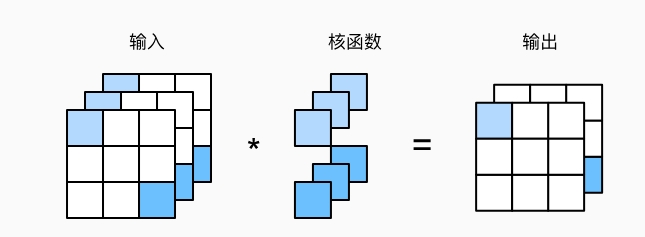

# wode_LLMs_practice


每一小节的标题是Repository里对应的文件夹名称.  
最大标题: \# 本repository名;  
第二标题: \#\# 本repository下的子项目名;  
第三标题: \#\#\# 各子项目下的问题名. 

反向传播最佳教程: [李宏毅反向传播](https://www.bilibili.com/video/BV1Wv411h7kN/?p=14&share_source=copy_web&vd_source=fa770b2848370154ff797b0ece7eae1b)

计算图最佳教程: [陈天奇计算图](https://www.youtube.com/watch?v=56WUlMEeAuA)


## 0_Pytorch_basics


三个常用命令:
```python
import torch
# 1. dir()
dir(torch.nn.functional)
# 2. help()
help(torch.cuda.is_available)  
# 3. ??

# 注意不是help(torch.cuda.is_available())
# help()也可以等同于??
# 比如torch.cuda.is_available??
```

[多通道卷积示意图](https://zh-v2.d2l.ai/chapter_convolutional-neural-networks/channels.html): 

卷积核数量 = channel_input * channel_output




**Dataset类总结:**  
(from torch.utils.data import Dataset)  
1. Constructor的输入为数据与标签路径
2. 要定义__getitem__方法与__len__方法
3. 核心: self.img_path = os.listdir(self.path)获取每一个item的名称, 从而展开__getitem__和__len__

### 训练与测试过程总结
加载数据: transform --> datasets --> dataloader

定义网络: nn.Module --> \_\_init\_\_() --> forward()

加载模型: 初始化一个Model() --> torch.load模型到state_dict --> load_state_dict加载参数 --> .to(device)

训练过程: 定义loss(), 定义optim() --> 设置epoch循环, 设置dataloader循环 --> __七步__ (1. 提取数据与标签, 2. 输入数据到模型得到output, 3. 计算loss, 4. optim梯度清零, 5. backward(), 6. optim.step()更新参数, 7. 保存模型torch.save(model.state_dict(), "name.pth"))

推理过程: 加载模型 --> with torch.no_grad()模式计算输出


## 1_NLP_basics


### NLP任务总览

主要任务: text-text, text-class

text-class: 1. 给整个文本一个类别, 2. 或给每个字符一个类别

摘要提取任务: seq2seq + copy_mechanism


**输入输出模式1:**  
i: seq  
o: class for each token  
相关应用: (1) word segmentation, (2) parsing--涉及构建语法树, (3) coreference resolution, (4) extractive summarization

**输入输出模式2:**  
i: seq  
o: seq  
相关应用: (1) abstractive summarization, (2) unsupervised machine translation, (3) grammar error correction


**输入输出模式3:**
i: seq   
o: cls  
相关应用: (1) sentiment classification

__一个关键点: unsupervised machine translation是最关键的, 没法弄到7000 * 7000的language pair来做一个翻译所有语言的大模型.__


### BERT是否需要word segmentation, parsing 以及 coreference resolution三种pre-processing呢?
BERT 使用的是一种基于 WordPiece Tokenization 的分词方法. 它可以将单词拆分为子词单元（subwords），这样可以更好地处理未见过的词或拼写错误的词，因此不需要传统的中文分词工具. 

BERT 是基于 Transformer 架构的，它通过自注意力机制可以直接捕捉句子中的长距离依赖关系，因此不需要手动进行句法分析。BERT 训练时基于句子的上下文，可以在不显式依赖树状句法结构的情况下学到丰富的句法和语义信息。

虽然 BERT 可以通过上下文信息捕捉到一定程度的指代关系（coreference），但它并没有显式的共指消解机制。如果特定任务需要非常准确的指代消解，则可能需要使用额外的模型进行专门的处理。然而，BERT 在某些共指消解任务上已经能取得不错的表现，因此通常不需要显式地进行这一预处理。

## BERT

(1) 一个很好地类比: `读大量文章+看往年试卷=得高分` = 
`pre-train+task-specific=good model`

(2) representation演化路线: 从为token编码到为token+context编码

(3) 其中一个演化过程: Contextualized Word Embedding model

(4) 其他变体: LSTM, Self-attention layers, Tree-based model (解数学式任务的时候最强, 文法结构最严谨时最强, 其他时候不如别的model)

(5) 更多变体: Transformer-XL, Reformer, Longformer

(6) 输入输出模式示例:  
input: one sentence, multiple sentences ([SEP])  
output: 1. one class ([CLS]), 2. class for each token, 3. copy from
 input (Extraction-based QA, 找一个开始POS一个结束POS达到extraction的效果), 4. general sequence (使用[SEP]提示model开始生成sequence, 上个时刻生成作为下个时刻输入)

(7) 更parameter-efficient的fine-tune方法: Adaptor Fine-Tune方法

(8) **十分有用**: 如何把大语言模型的Loss图像画出来?  
Deep Learning Theory 2-5: Geometry of Loss Surfaces (Empirical): https://www.youtube.com/watch?v=XysGHdNOTbg  
https://arxiv.org/pdf/1908.05620


(9) 区分开`self-supervised learning`与`autoregression`, autoregressive model由左而右进行生成, BERT并不擅长这个, 所以这个角度可以推出BERT不擅长言辞

(10) 'You shall know a word by the company it keeps.' -- J.R. Firth, 这句话说明了上下文的重要性.

(11) Bert (no limitation on self-attention, 全局的注意力) 预测[MASK]或[Random Token], 完形填空

(12) BERT不擅长generation任务

(13) 一句话总结ERNIE, random masking到whole word masking (WWM)

(14) 一句话总结SpanBert: Span Boundary Objective (SBO)

(15) 一句话总结XLNet (Transformer-XL): 随机看上下文预测[MASK] token

(16) 一句话总结ELMo: predict next token (LSTM)

(17) 一句话总结Electra: (由小的BERT来生成替代[MASK]的词汇作为干扰模型的输入)

(18) 其他模型: MASS, BART来做seq2seq任务, UniLM, Transfer Text-to-Text Transformer (T5), Colossal Clean Crawled Corpus (C4)


(19) Bert任务: MLM+NSP+SOP


## Language Models are Few-Shot Learners (GPT-3)

**GPT-3最想做的事情: Zero-Shot Learning**

三种x-shot学习区分:

(1) few-shot learning: task description + examples + prompt  
(2) one-shot learning: task description + example + prompt  
(3) zero-shot learning: task description + prompt  

In-Context Learning (不同于few-shot learning, 不Fine-Tune, 不做参数更新)

GPT-3不擅长做NLI (Natural Language Inference)问题

Turing Advice Challenge
http://rowanzellers.com/advice/


## 2_transformer_basics


### token序列常规编码方式总结
RNN (如LSTM):  

$`\boldsymbol{y}_t =f(\boldsymbol{y}_{t-1},\boldsymbol{x}_t)  `$

CNN:  

$`\boldsymbol{y}_t = f(\boldsymbol{x}_{t-1},\boldsymbol{x}_t,\boldsymbol{x}_{t+1})`$

Attention:  

$`\boldsymbol{y}_t = f(\boldsymbol{x}_t,\boldsymbol{A},\boldsymbol{B})`$  

其中, A和B是另外的词语序列 (矩阵)


### 模型文件保存
.pth 是 PyTorch 社区中常用的文件扩展名，通常用于保存模型权重、模型状态或训练检查点

.bin 是一个通用的二进制文件扩展名，可能更常用于保存任意二进制数据

### 关于学习率, 1e-5和5e-5的差距非常大

蚂蚁金融语义相似度数据集

| 训练细节 | 正确率, epoch 1, 2, 3|
| :------:| :--------:| 
| 1e-5学习率, 训练shuffle=False | 69.4, 72.2, 73.7 |
| 5e-5学习率, 训练shuffle=False| 69.0, 69.0, 69.0 |
| 1e-5学习率, 训练shuffle=True | 72.6, 73.3, 73.9|